# SYNAPSE — Flowcharts & System Diagrams

> Guia visual completo de como o SYNAPSE funciona: pipeline, layers, domains,
> conexoes com Memory Intelligence System (MIS) e Activation Pipeline (UAP).

**Versao:** 1.0.0
**Data:** 2026-02-11
**Autor:** @architect (Aria)
**Status:** Living Document

---

## 1. Visao Geral do Sistema

O SYNAPSE (Synkra Adaptive Processing & State Engine) e o motor de contexto JIT do AIOS.
A cada prompt do usuario, ele injeta `<synapse-rules>` com regras contextuais adaptativas.

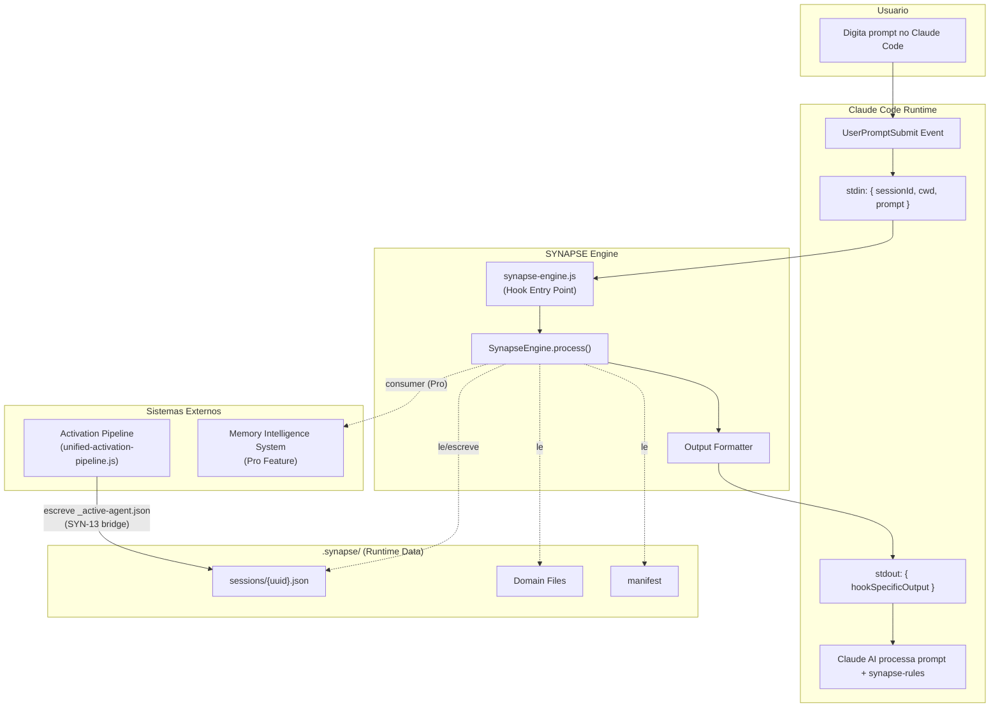

---

## 2. Hook Entry Point — Ciclo de Vida por Prompt

Cada prompt do usuario dispara o hook. O entry point e fino (~78 linhas)
e delega todo o trabalho para o SynapseEngine.

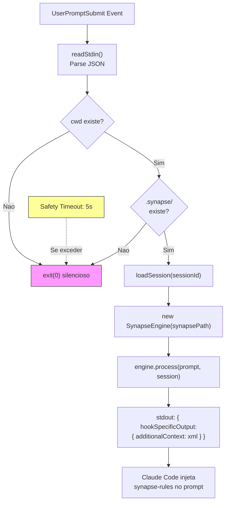

---

## 3. Pipeline de 8 Layers — Fluxo Principal

O engine executa os layers sequencialmente (L0→L7), respeitando
o Context Bracket que determina quais layers estao ativos.

```mermaid
flowchart LR
    INPUT["prompt<br/>session<br/>config"] --> BRACKET["Context Tracker<br/>calcula bracket"]
    BRACKET --> L0["L0: Constitution<br/>5ms | NON-NEGOTIABLE"]
    L0 --> L1["L1: Global<br/>10ms | ALWAYS_ON"]
    L1 --> L2["L2: Agent<br/>15ms | session.active_agent"]
    L2 --> L3["L3: Workflow<br/>15ms | session.active_workflow"]
    L3 --> L4["L4: Task<br/>15ms | session.active_task"]
    L4 --> L5["L5: Squad<br/>15ms | session.active_squad"]
    L5 --> L6["L6: Keyword<br/>15ms | RECALL matching"]
    L6 --> L7["L7: Star-Command<br/>5ms | *command detection"]
    L7 --> MEM{"Memory<br/>Bridge"}
    MEM --> FORMAT["Output Formatter<br/>→ <synapse-rules>"]

    style L0 fill:#ff6b6b,color:#fff
    style L1 fill:#4ecdc4,color:#fff
    style L2 fill:#45b7d1,color:#fff
    style L3 fill:#96ceb4,color:#fff
    style L4 fill:#ffeaa7,color:#333
    style L5 fill:#dfe6e9,color:#333
    style L6 fill:#a29bfe,color:#fff
    style L7 fill:#fd79a8,color:#fff
    style MEM fill:#6c5ce7,color:#fff
```

---

## 4. Context Brackets — Layers Ativos por Bracket

O Context Tracker estima o % de contexto restante baseado no prompt_count
e seleciona quais layers executar.

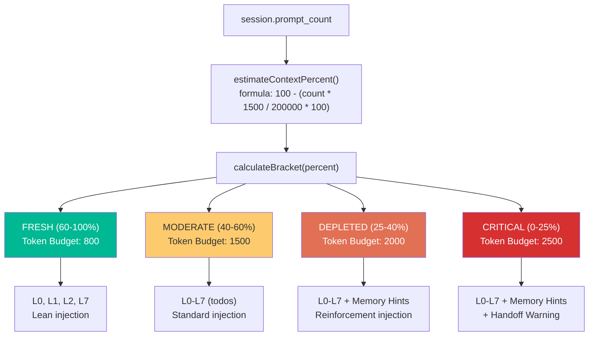

### Tabela de Brackets

| Bracket | Context % | Layers Ativos | Token Budget | Memory Hints | Handoff Warning |
|---------|-----------|---------------|-------------|-------------|-----------------|
| FRESH | 60-100% | L0, L1, L2, L7 | 800 | Nao | Nao |
| MODERATE | 40-60% | L0-L7 (todos) | 1500 | Nao | Nao |
| DEPLETED | 25-40% | L0-L7 (todos) | 2000 | Sim | Nao |
| CRITICAL | 0-25% | L0-L7 (todos) | 2500 | Sim | Sim |

---

## 5. Domain System — Manifest + Domain Files

O `.synapse/manifest` e o registro central de todos os domains.
Cada domain tem um arquivo com regras em formato KEY=VALUE ou plain text.

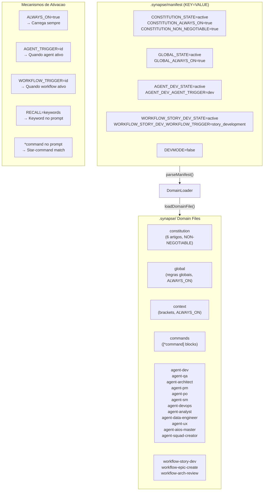

### Domain Attributes

| Attribute | Formato | Funcao |
|-----------|---------|--------|
| `{DOMAIN}_STATE` | `active\|inactive` | Liga/desliga o domain |
| `{DOMAIN}_ALWAYS_ON` | `true` | Carrega em TODO prompt |
| `{DOMAIN}_NON_NEGOTIABLE` | `true` | Nao pode ser desligado |
| `{DOMAIN}_AGENT_TRIGGER` | `agent_id` | Ativa quando agent ativo |
| `{DOMAIN}_WORKFLOW_TRIGGER` | `workflow_id` | Ativa quando workflow ativo |
| `{DOMAIN}_RECALL` | `kw1,kw2,...` | Ativa por keyword match |
| `{DOMAIN}_EXCLUDE` | `skip1,skip2,...` | Exclui quando keyword presente |

---

## 6. Session Management — Estado Persistente

Cada sessao Claude Code tem um arquivo JSON em `.synapse/sessions/`.
A session rastreia agent ativo, workflow, task, squad e historico.

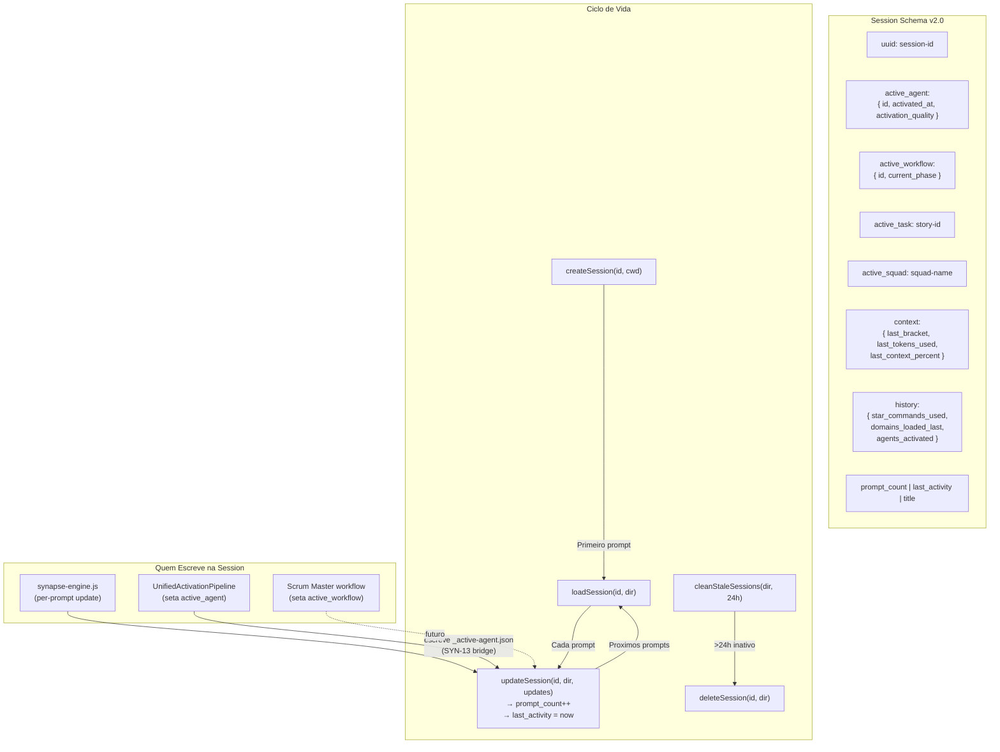

---

## 7. Conexao com Activation Pipeline (UAP)

O SYNAPSE **NAO substitui** o UnifiedActivationPipeline — ele o **complementa**.
O UAP executa na ativacao do agente (uma vez). O SYNAPSE executa a cada prompt.

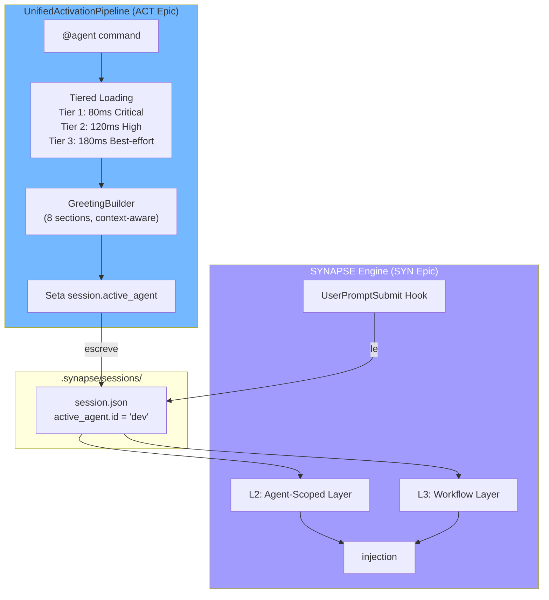

### Separacao de Responsabilidades

| Aspecto | UAP (Activation Pipeline) | SYNAPSE Engine |
|---------|--------------------------|----------------|
| **Trigger** | `@agent` command (uma vez) | Cada prompt (automatico) |
| **Funcao** | Greeting + agent config | Context injection |
| **Performance** | 168ms p50 (one-shot) | <100ms per-prompt |
| **Output** | Greeting visual no terminal | `<synapse-rules>` invisivel |
| **Session** | Escreve `active_agent` | Le `active_agent` para L2 |

---

## 8. Conexao com Memory Intelligence System (MIS)

O SYNAPSE consome o MIS via **MemoryBridge** — um consumer feature-gated
que so ativa com licenca Pro. Nunca modifica a memoria, apenas le.

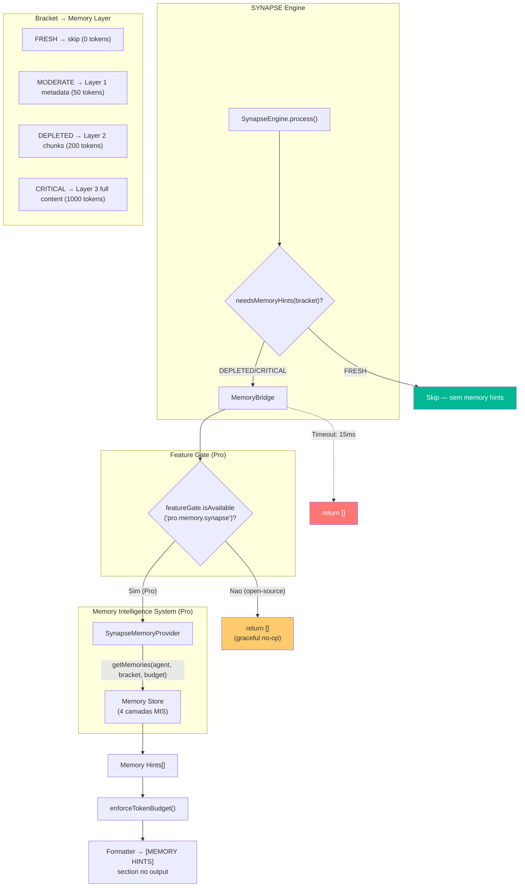

### Caracteristicas do MemoryBridge

| Aspecto | Detalhe |
|---------|---------|
| **Tipo** | Consumer only (read-only) |
| **Feature Gate** | `pro.memory.synapse` |
| **Timeout** | 15ms (hard limit) |
| **Fallback** | return [] (graceful no-op) |
| **Cache** | Session-level via provider |
| **Lazy Load** | Provider carregado sob demanda |

---

## 9. Output Formatter — Montagem do XML Final

O formatter recebe os resultados de todos os layers e monta o
`<synapse-rules>` XML respeitando ordem de secoes e token budget.

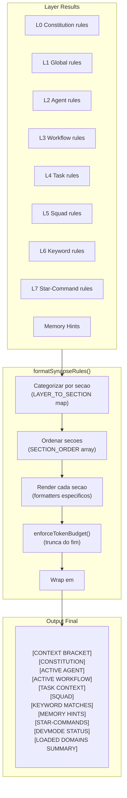

### Ordem de Secoes (prioridade de truncamento)

Quando o token budget e excedido, secoes sao removidas do FIM primeiro:

| # | Secao | Protegida? | Truncamento |
|---|-------|-----------|-------------|
| 1 | CONTEXT_BRACKET | Sim | Nunca removida |
| 2 | CONSTITUTION | Sim | Nunca removida |
| 3 | AGENT | Sim | Nunca removida |
| 4 | WORKFLOW | Nao | Removida por ultimo |
| 5 | TASK | Nao | Removida 5o |
| 6 | SQUAD | Nao | Removida 4o |
| 7 | KEYWORD | Nao | Removida 2o |
| 8 | MEMORY_HINTS | Nao | Removida 3o |
| 9 | STAR_COMMANDS | Nao | Removida 4o |
| 10 | DEVMODE | Nao | Removida 5o |
| 11 | SUMMARY | Nao | Removida 1o (primeiro a sair) |

---

## 10. Fallback & Error Recovery

Cada camada do SYNAPSE implementa graceful degradation.
Nenhum erro bloqueia o prompt do usuario.

```mermaid
flowchart TD
    subgraph LAYER_FALLBACK["Per-Layer Fallback"]
        TRY["LayerProcessor._safeProcess()"] --> CHECK{"Sucesso?"}
        CHECK -->|"Sim"| RETURN["Retorna rules[]"]
        CHECK -->|"Timeout > budget"| WARN["console.warn + retorna result"]
        CHECK -->|"Error"| NULL["Retorna null (skip layer)"]
    end

    subgraph PIPELINE_FALLBACK["Pipeline Fallback"]
        PIPE_START["Pipeline start"] --> PIPE_CHECK{"Elapsed > 100ms?"}
        PIPE_CHECK -->|"Sim"| PIPE_SKIP["Skip remaining layers<br/>(reason: Pipeline timeout)"]
        PIPE_CHECK -->|"Nao"| PIPE_NEXT["Executa proximo layer"]
    end

    subgraph HOOK_FALLBACK["Hook Entry Fallback"]
        HOOK_ERROR["Qualquer erro no main()"] --> HOOK_EXIT["console.error + exit(0)<br/>(nunca bloqueia prompt)"]
        HOOK_TIMEOUT["Safety timeout: 5s"] --> HOOK_EXIT
    end

    subgraph MEMORY_FALLBACK["Memory Bridge Fallback"]
        MEM_NO_PRO["Pro nao instalado"] --> MEM_EMPTY["return []"]
        MEM_TIMEOUT["Timeout > 15ms"] --> MEM_EMPTY
        MEM_ERROR["Provider erro"] --> MEM_EMPTY
    end

    style NULL fill:#ffeaa7,color:#333
    style PIPE_SKIP fill:#fab1a0,color:#333
    style HOOK_EXIT fill:#ff7675,color:#fff
    style MEM_EMPTY fill:#81ecec,color:#333
```

---

## 11. Layer Processing Detail — Cada Layer Explicado

```mermaid
flowchart TD
    subgraph L0["L0: Constitution (5ms)"]
        L0_IN["Trigger: ALWAYS_ON + NON_NEGOTIABLE"]
        L0_LOAD["Carrega .synapse/constitution"]
        L0_OUT["6 Artigos constitucionais<br/>CLI First, Agent Authority, etc."]
        L0_IN --> L0_LOAD --> L0_OUT
    end

    subgraph L1["L1: Global (10ms)"]
        L1_IN["Trigger: ALWAYS_ON"]
        L1_LOAD["Carrega .synapse/global"]
        L1_OUT["Regras globais aplicaveis<br/>a todo contexto"]
        L1_IN --> L1_LOAD --> L1_OUT
    end

    subgraph L2["L2: Agent-Scoped (15ms)"]
        L2_IN["Trigger: session.active_agent.id"]
        L2_MATCH["Busca AGENT_{X}_AGENT_TRIGGER={id}<br/>no manifest"]
        L2_LOAD["Carrega .synapse/agent-{id}"]
        L2_OUT["Regras do agente ativo<br/>+ authority boundaries"]
        L2_IN --> L2_MATCH --> L2_LOAD --> L2_OUT
    end

    subgraph L3["L3: Workflow (15ms)"]
        L3_IN["Trigger: session.active_workflow.id"]
        L3_MATCH["Busca WORKFLOW_{X}_WORKFLOW_TRIGGER={id}<br/>no manifest"]
        L3_LOAD["Carrega .synapse/workflow-{id}"]
        L3_OUT["Regras do workflow ativo<br/>+ fase atual"]
        L3_IN --> L3_MATCH --> L3_LOAD --> L3_OUT
    end

    subgraph L4["L4: Task (15ms)"]
        L4_IN["Trigger: session.active_task"]
        L4_OUT["Contexto da task ativa<br/>(story ID, pre-conditions, AC)"]
        L4_IN --> L4_OUT
    end

    subgraph L5["L5: Squad (15ms)"]
        L5_IN["Trigger: session.active_squad"]
        L5_OUT["Regras do squad ativo<br/>(dynamic domain discovery)"]
        L5_IN --> L5_OUT
    end

    subgraph L6["L6: Keyword (15ms)"]
        L6_IN["Trigger: RECALL keywords no prompt"]
        L6_SCAN["Varre manifest: {DOMAIN}_RECALL=kw1,kw2"]
        L6_MATCH["matchKeywords(prompt, recall)"]
        L6_EXCL["isExcluded(prompt, excludes)?"]
        L6_LOAD["Carrega domain files matchados"]
        L6_OUT["Regras de domains ativados<br/>por keyword"]
        L6_IN --> L6_SCAN --> L6_MATCH --> L6_EXCL
        L6_EXCL -->|"Nao excluido"| L6_LOAD --> L6_OUT
        L6_EXCL -->|"Excluido"| L6_SKIP["Skip domain"]
    end

    subgraph L7["L7: Star-Command (5ms)"]
        L7_IN["Trigger: *command no prompt"]
        L7_REGEX["Regex: /\\*([a-z][\\w-]*)/gi"]
        L7_LOAD["Carrega .synapse/commands"]
        L7_PARSE["Extrai bloco [*command]"]
        L7_OUT["Regras do comando detectado"]
        L7_IN --> L7_REGEX --> L7_LOAD --> L7_PARSE --> L7_OUT
    end
```

---

## 12. Fluxo Completo End-to-End (Exemplo Real)

Cenario: usuario ativa `@dev` e depois digita `*draft uma feature de login`

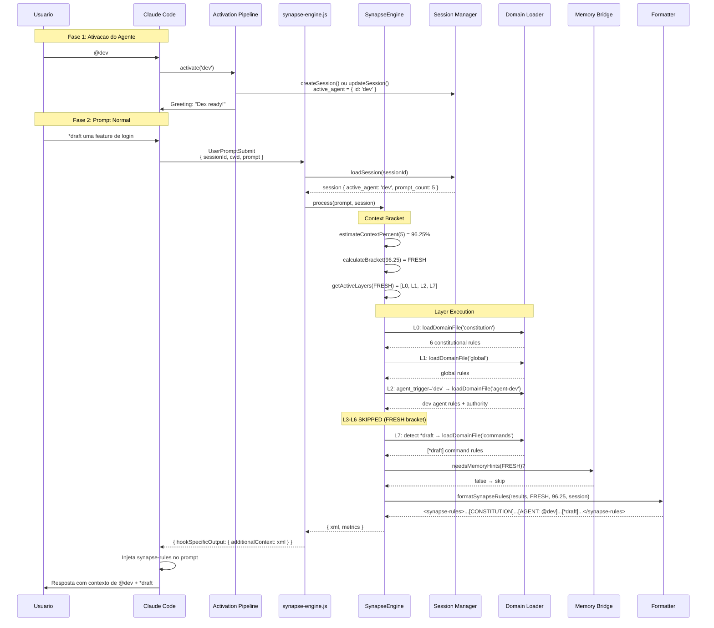

---

## 13. Arvore de Arquivos — Mapa Completo

```
aios-core/
├── .claude/
│   └── hooks/
│       └── synapse-engine.js              # Hook entry point (78 linhas)
│
├── .aios-core/core/synapse/               # Engine core (modular)
│   ├── engine.js                          # SynapseEngine orchestrator
│   ├── context/
│   │   └── context-tracker.js             # Bracket calculation (SYN-3)
│   ├── domain/
│   │   └── domain-loader.js               # Manifest parser + domain loader (SYN-1)
│   ├── layers/
│   │   ├── layer-processor.js             # Abstract base class
│   │   ├── l0-constitution.js             # NON-NEGOTIABLE rules (SYN-4)
│   │   ├── l1-global.js                   # Global ALWAYS_ON rules (SYN-4)
│   │   ├── l2-agent.js                    # Agent-scoped rules (SYN-4)
│   │   ├── l3-workflow.js                 # Workflow-scoped rules (SYN-4)
│   │   ├── l4-task.js                     # Task context (SYN-5)
│   │   ├── l5-squad.js                    # Squad domains (SYN-5)
│   │   ├── l6-keyword.js                  # RECALL keyword matching (SYN-5)
│   │   └── l7-star-command.js             # *command detection (SYN-5)
│   ├── memory/
│   │   └── memory-bridge.js               # MIS consumer, Pro-gated (SYN-10)
│   ├── output/
│   │   └── formatter.js                   # XML output formatter (SYN-6)
│   ├── session/
│   │   └── session-manager.js             # Session CRUD + cleanup (SYN-2)
│   ├── scripts/
│   │   └── generate-constitution.js       # Auto-gen constitution domain
│   └── utils/
│       ├── paths.js                       # Path resolution helpers
│       └── tokens.js                      # Token estimation
│
├── .synapse/                              # Runtime data (gitignored sessions/)
│   ├── manifest                           # Domain registry (KEY=VALUE)
│   ├── constitution                       # L0 domain (auto-generated)
│   ├── global                             # L1 domain
│   ├── context                            # L1 context brackets
│   ├── commands                           # L7 star-command blocks
│   ├── agent-dev                          # L2 @dev domain
│   ├── agent-qa                           # L2 @qa domain
│   ├── agent-architect                    # L2 @architect domain
│   ├── agent-pm                           # L2 @pm domain
│   ├── agent-po                           # L2 @po domain
│   ├── agent-sm                           # L2 @sm domain
│   ├── agent-devops                       # L2 @devops domain
│   ├── agent-analyst                      # L2 @analyst domain
│   ├── agent-data-engineer                # L2 @data-engineer domain
│   ├── agent-ux                           # L2 @ux domain
│   ├── agent-aios-master                  # L2 @aios-master domain
│   ├── agent-squad-creator                # L2 @squad-creator domain
│   ├── workflow-story-dev                 # L3 story development domain
│   ├── workflow-epic-create               # L3 epic creation domain
│   ├── workflow-arch-review               # L3 architecture review domain
│   ├── sessions/                          # Session JSON files (gitignored)
│   └── cache/                             # Cache dir (gitignored)
│
├── .aios-core/development/scripts/
│   ├── unified-activation-pipeline.js     # UAP — agent activation
│   └── greeting-builder.js               # Greeting assembly
│
└── pro/                                   # Pro submodule (proprietary)
    ├── license/
    │   └── feature-gate.js                # Feature gate for Pro
    └── memory/
        └── synapse-memory-provider.js     # MIS provider for SYNAPSE
```

---

## 14. Relacao entre Epics

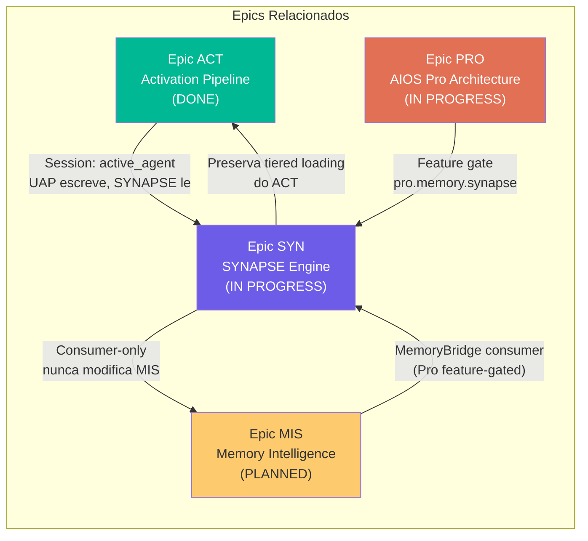

---

*Documento gerado por @architect (Aria)*
*Baseado na implementacao real do codebase — nao especulativo*

— Aria, arquitetando o futuro 🏗️
